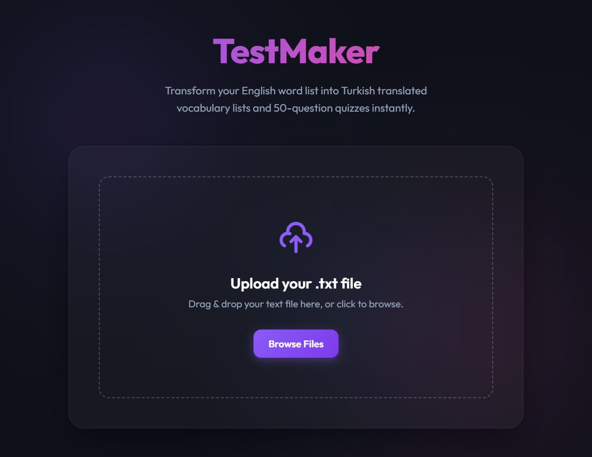

# TestMaker 🚀

TestMaker is a fast, modern web application designed to help English learners and teachers effortlessly generate Turkish translated vocabulary lists and 50-question quizzes from a simple `.txt` file.



## Overview

The application takes a `.txt` file containing English vocabulary words, translates them into Turkish via the **DeepL API**, and automatically generates two highly formatted PDF files:

1.  **Vocabulary List PDF**: A clean, two-column PDF displaying the original English words and their Turkish translations back-to-back.
2.  **Quiz PDF**: A 50-question multiple-choice quiz automatically generated by picking random translated words as distractors to test vocabulary retention.

### Under the Hood

This project has recently been modernized!

- **Backend:** Powered by `FastAPI` for lightning-fast API responses and asynchronous file processing.
- **Frontend:** A beautiful, responsive "glassmorphic" interface built with Vanilla HTML/CSS/JS, featuring gradient meshes and smooth micro-animations.

---

## Installation & Setup ⚙️

### 1. Prerequisites

Ensure you have Python 3.8+ installed on your system.

### 2. Clone the Repository

```bash
git clone https://github.com/TalhaTufanN/english-turkish-vocab-quiz.git
cd english-turkish-vocab-quiz
```

### 3. Install Dependencies

Install the required Python packages using pip:

```bash
pip install -r requirements.txt
```

### 4. Setup Environment Variables (.env)

TestMaker relies on the DeepL API for highly accurate translations. You will need an API key.

1.  Sign up for a free API key at [DeepL Developer](https://www.deepl.com/pro-api).
2.  Create a file named `.env` in the root directory of the project.
3.  Add your API key inside the `.env` file like this:

```env
DEEPL_API_KEY="your_actual_deepl_api_key_here"
```

## Running the Application 🏃‍♂️

Start the local FastAPI development server using Uvicorn:

```bash
python -m uvicorn app:app --reload
```

Once the server is running, open your favorite web browser and navigate to:
👉 **[http://localhost:8000](http://localhost:8000)**

## Usage Guide 📝

1.  Prepare a `.txt` file with line-separated English words. (Ensure the file has at least 50 words to generate the quiz properly). _Note: You can include abbreviations like `v.`, `n.`, but the app will automatically clean them before translation for maximum accuracy._
2.  Drop the `.txt` file into the beautiful drag-and-drop zone on the web interface.
3.  Wait a moment for the DeepL translations to complete.
4.  Download your newly generated PDF files!

---

🎯 _Designed with aesthetic excellence and functionality in mind._
